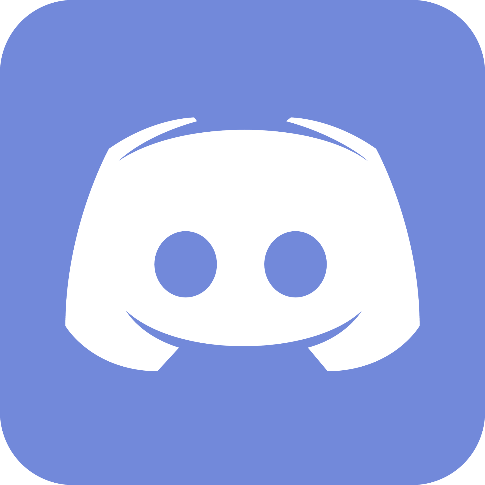

# Chatbot MVC com Bot do Discord


Este é um chatbot Discord implementado usando o padrão MVC (Model-View-Controller).

## Estrutura do Projeto

```
.
├── bot.py              # Arquivo principal do bot
├── controller/         # Camada de Controller
├── model/             # Camada de Model
├── view/              # Camada de View
├── utils/             # Utilitários
│   └── logger.py     # Sistema de logging
├── dados/            # Dados do chatbot
│   └── puc/         # Informações da UC
└── logs/            # Logs do sistema
=======


Instalar os requirements:

```
pip install -r requirements.txt

```

## Funcionalidades

### Comandos Básicos
- `!uc` - Informações gerais
- `!competencias` - Competências a desenvolver
- `!roteiro` - Conteúdo programático
- `!metodologia` - Metodologia de ensino
- `!recursos` - Recursos disponíveis
- `!calendario` - Datas importantes
- `!avaliacao` - Método de avaliação
- `!exame` - Informações sobre exames
- `!ia` - Uso de IA na UC
- `!estrutura` - Estrutura da equipa
- `!cartao` - Cartão de aprendizagem

### Comandos de Administrador
- `!relatorio` - Gera relatório de uso
- `!estatisticas` - Mostra estatísticas
- `!historico ` - Histórico de um utilizador

### Comandos de Ajuda
- `!help` - Mostra todos os comandos disponíveis
- `!help <comando>` - Mostra ajuda específica para um comando
- `!ajuda` - Alternativa ao comando help

## Sistema de Logs

O sistema de logs foi implementado para facilitar o debug e monitoramento do bot. Os logs são salvos em:
- Diretório: `./logs/`
- Formato: `chatbot_YYYYMMDD.log`
- Níveis: DEBUG, INFO, WARNING, ERROR, CRITICAL
- Rotação: 5MB por arquivo, mantém últimos 5 arquivos
```

## Configuração
Crie um arquivo `.env` com:
```
DISCORD_TOKEN=seu_token_aqui
DISCORD_GUILD=
ADMIN_IDS= # Definir os IDS dos administradores
```

2. Instale as dependências:
```bash
pip install -r requirements.txt
```

3. Execute o bot:
```bash
python bot.py
```

## Responsabilidades da Equipe

- **Tester (Rúben)**: Lider do Projeto
- **Model (Duarte)**: Implementação da camada de Model, gestão de dados JSON
- **Controller (Sofia)**: Implementação da camada de Controller, processamento de comandos
- **View (Yuran)**: Interface Discord, comandos e apresentação
- **Tester (Carlos)**: Testes funcionais e validação
=======
pip install -r requirements-testes.txt
```